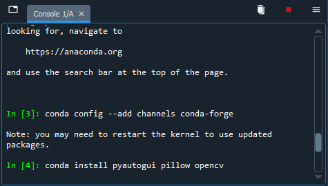

# Méthodes d'installation pour l'activité

## Table des matières

- [Méthodes d'installation pour l'activité](#méthodes-dinstallation-pour-lactivité)
  - [Table des matières](#table-des-matières)
  - [Installation selon l'outil](#installation-selon-loutil)
    - [Spyder](#spyder)

## Installation selon l'outil

### Spyder

> **IMPORTANT** : Selon le type d'installation, il se peut que le répertoire des
> bibliothèques soit non-inscriptible, c'est-à-dire que tu ne peux pas installer
> d'autres bibliothèques.
>
> Il existe cependant une solution courante face à ce problème : tu fermes
> Spyder et tu le ré-ouvres avec les permissions administrateur en faisant
> bouton droit sur le raccourci et en cliquant sur « Exécuter en tant 
> qu'administrateur ».

Avant de pouvoir installer les bibliothèques nécessaires à la réalisation de
l'activité, il faut tout d'abord rajouter un canal.

Un canal est un ensemble de bibliothèques situé sur les serveurs d'Anaconda,
et il est nécessaire d'en rajouter un ici pour installer les bibliothèques
PyAutoGUI et OpenCV.

Voici les étapes à suivre :

1. Ajoute le canal `conda-forge` en tapant cette commande depuis la console
   de Spyder :
   ```py
   conda --add channels conda-forge
   ``` 
2. Installe les bibliothèques nécessaires à l'activité en tapant cette commande,
   toujours depuis la console :
   ```py
   conda install pyautogui pillow opencv
   ```



**ATTENTION** : Conda étant un gestionnaire de bibliothèques assez lent, cette
étape peut sembler très long. Il se peut même que la commande soit « bloquée »
en apparence. **Il suffit d'être patient**, Conda vérifie qu'il n'y a pas de
conflits dans l'environnement avant l'installation. ⌚
